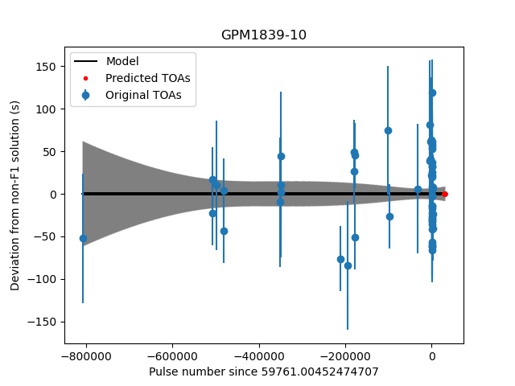

# Basic TOA predictor for ULPs

## Dependencies

- `astropy`
- `numpy`
- `scipy`
- `matplotlib`

## Usage

```
usage: ULP TOA predictor [-h] [--nobary] [--outbary] [--no_inf_freq] [--outfile OUTFILE] [--outplot OUTPLOT]
                         [--outfreq OUTFREQ] [--time_format TIME_FORMAT] [--refit]
                         timfile parfile time_range time_range planetary_ephemeris

Basic TOA predictor for long-period objects.

positional arguments:
  timfile               The path to a '.tim' TOA file. Only "FORMAT 1" is supported here; this parses that file manually (to avoid being dependent on TEMPO/PINT).
  parfile               The path to a '.par' ephemeris file. This is used to set the initial parameters for curve_fit.
  time_range            The range of times to produce predicted TOAs for (by default, expects MJDs, but see --time_format).
  planetary_ephemeris   The path to the planetary ephemeris file to use (e.g. "de430.bsp")

options:
  -h, --help            show this help message and exit
  --nobary              Turn off barycentring (e.g. if the provided TOAs have already been barycentred).
  --outbary             Output barycentric MJDs (default is to convert to topocentric).
  --no_inf_freq         Turn off DM correction to infinite frequency (e.g. if the TOAs in the .tim file have already been so corrected).
  --outfile OUTFILE     The file to write out the predicted TOAs to. If not provided, the TOAs are written to stdout.
  --outplot OUTPLOT     Create an "F1 residual" plot and save it to the given path. The format is selected by the extension, and must be supported by matplotlibs savefig() function.
  --outfreq OUTFREQ     The output TOAs are delayed for this frequency (in MHz). If not supplied, no delay is added.
  --time_format TIME_FORMAT
                        The format of the supplied times given by the "time_range" argument (default: "mjd", but can be any valid string taken by the Astropy Time constructor).
  --out_time_format OUT_TIME_FORMAT
                        The output time format (default: "mjd", but can be any valid string taken by the Time class's to_value() function).
```

### Example

Predict the arrival times between MJDs 60200 and 60250:
```
python predict_toas.py --outfile test.out --outplot example.png --outfreq 150 J1839.tim J1839.par 60200 60250 $PWD/de430.bsp
```


